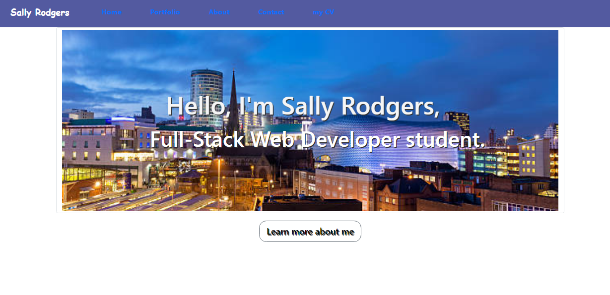

# React Portfolio
(formerly Personal-Portfolio)
This repository has been created to consolidate a 'first view' portfolio of work created on my journey to become a Full Stack Web Developer.

1.  Link to CV: For further information, please email hellosally1@yahoo.com

2.  Link to Password Generator page: https://sallyxp.github.io/Password-Generator/

3.  Link to Work Day Scheduler: https://sallyxp.github.io/Work-Day-Scheduler/

# Installation Instructions

To run this webpage, click on the link below:

https://sallyxp.github.io/Portfolio-React/#/Portfolio-React/portfolio open the HTML File with your default browser.
 
 # Usage
 
This repository contains components, pages and associated files used to demonstrate my current abilities on my journey to become a Full Stack Web Developer. 

The site is mobile-responsive.  The navigation bar navigates around the pages listed. There is also a link to my CV, held on my Google Drive.  In addition this link is also listed above.

Home contains an evening image of Birmingham City Centre, and also a direct link to  My Portfolio.

The portfolio tells information of 3 projects.
The first item is a Week-Day-Scheduler, there is a brief description of it, a screenshot, a link to its Github Repository and another link to the deployed webpage.

The second item is an earlier project, a random password generator.  There is again an image of its landing page, a brief description, a link to its Github Repository and 
also to its deployed website.

The third item, a Few Fries Short, is a group collaboration written in node.js, javascript and mySQL2.  It uses the Model-View-Controller paradigm and allows the user to write reviews and comment on others (if logged into the system).

There is a sticky footer at the base of the page.

# Technologies Used

The site is written using HTML, CSS, React, Bootstrap and JavaScript.  Images have been cited within the repository. Icons have been used from Font Awesome.

# Contributors
I should like to thank:
Brian Lewicki from Unsplash whose royalty-free images I have used within this project. 

# Licence

The site is licensed with an MIT Licence - shown in the Github Repository.

# Contact Information

A link to my CV is above.  I am contactable on sallyhello1@yahoo.com.

Sally Rodgers

